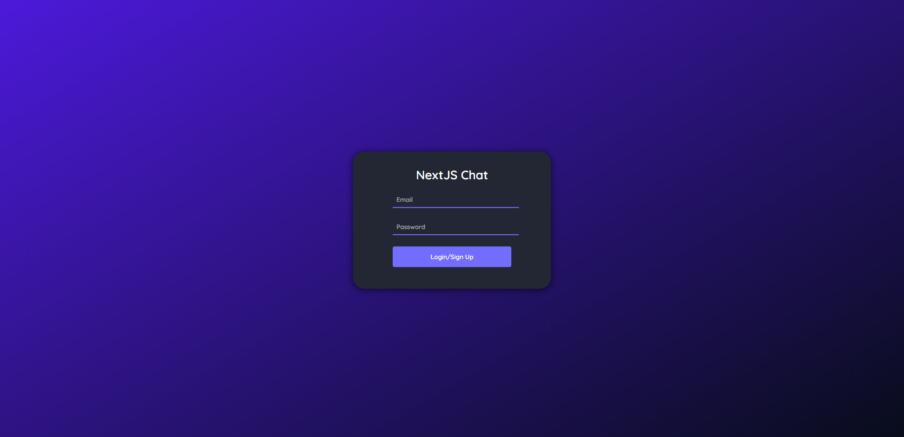
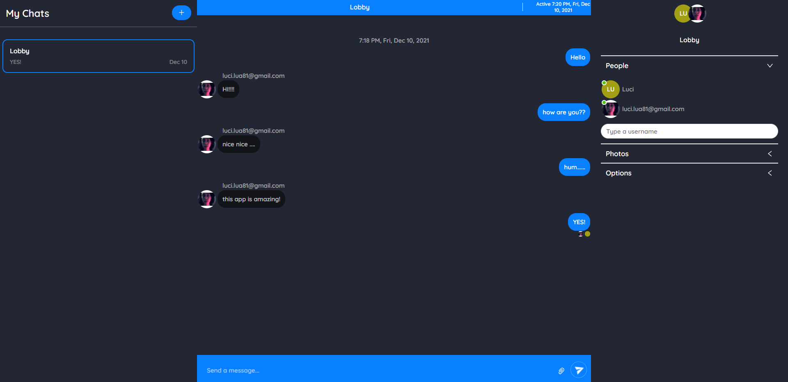
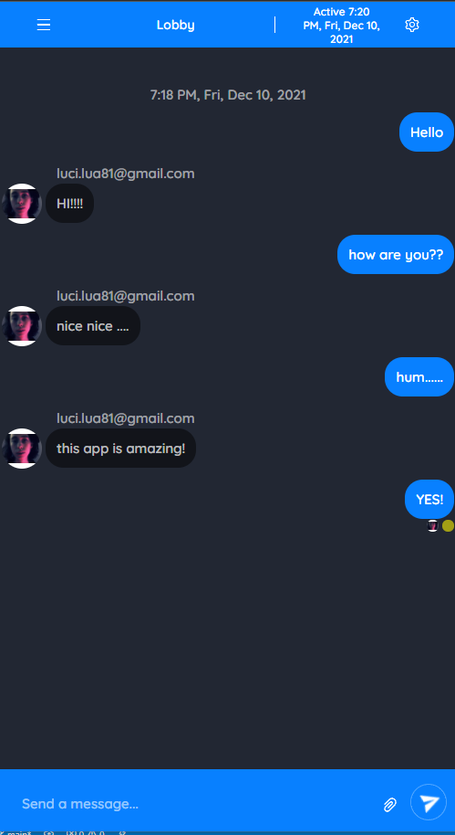

## 🗣 Next Chat App 🗣

**A chat app made in react, still in development**

I was able to start this project through the tutorial on the [Adam La Morre channel](https://www.youtube.com/channel/UCWf3dHZo_qzhnRkWiobCguw), [video here](https://www.youtube.com/watch?v=Gbnjn-1Q2d8)

 
 

## 🛠 Tecnologias usadas
   
 

## 🚀 How to start

If you want to learn a little about how this application is being built, as well as the technologies used, take a look at this topic, please pay attention to the MIT license and its limitations, good studies! Feel free to mark insues in this repository too

### 📌 Requirement

> node package manager (NPM or YARN)

### ✨ Now are you ready to start 

> clone the repository
<code> git clone https://github.com/LuciLua/nextChatApp.git</code>

> open project folder
<code> cd ./nextChatApp</code>

> install all packages using npm or yarn manager (using NPM)
<code> npm i </code>

> start the development server (using NPM)
<code> npm run dev </code>

### 🏗 Build 

> to make a build (using NPM)
<code> npm build </code>

> to start the server in production-ready mode (using NPM)
<code> npm run start </code>

## 🖼 Preview

**So far, this is the preview, but you can check it out at [this updated link](https://next-chat-app-five.vercel.app/)**

